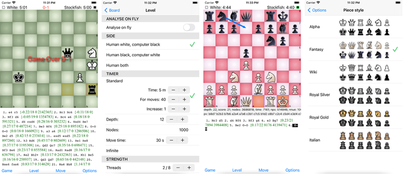
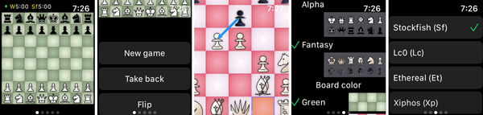
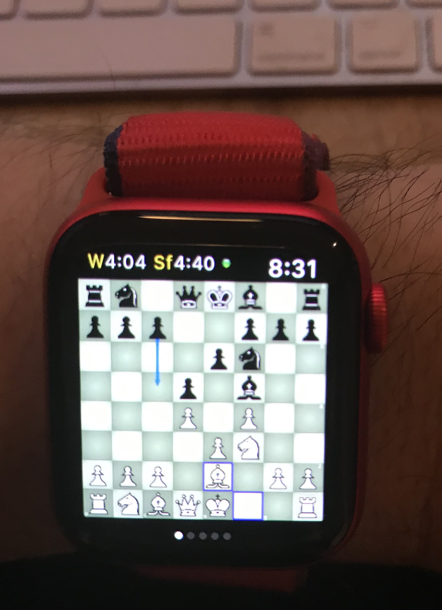
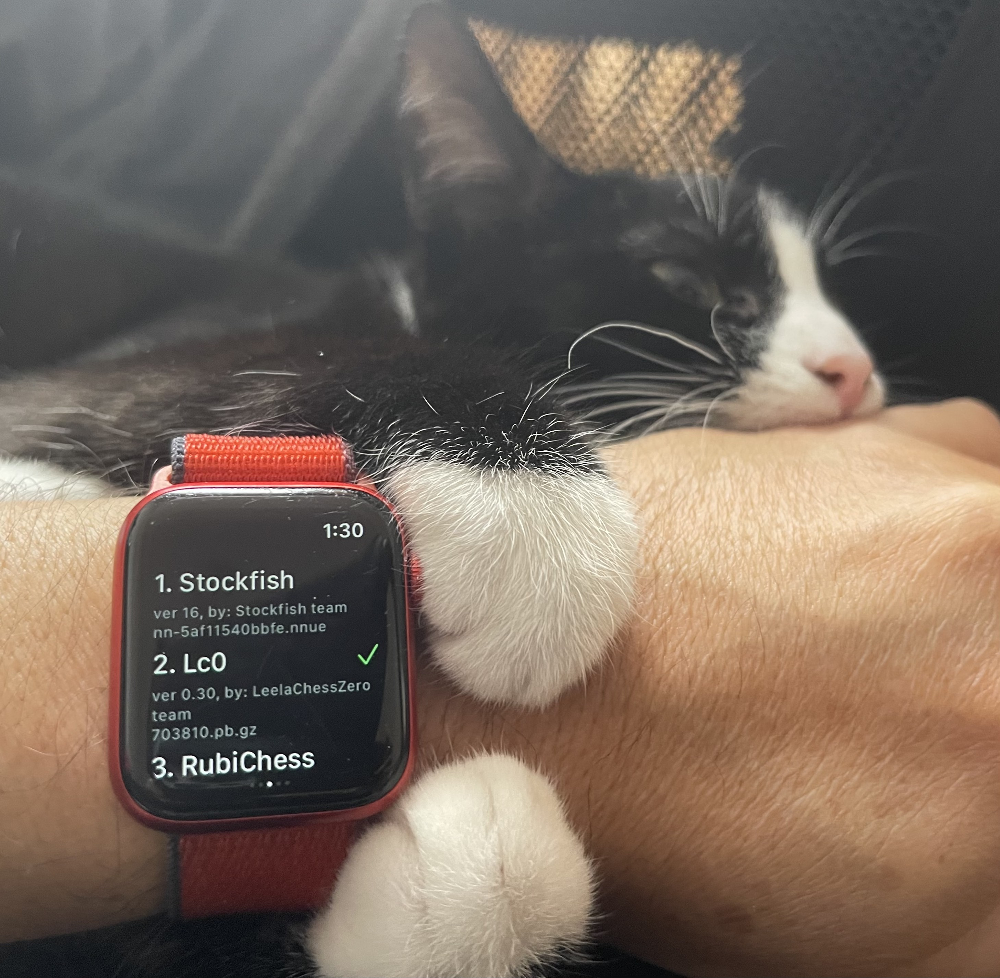

# Banksia GUI for iOS

## What is Banksia, Banksia GUI and Banksia GUI for iOS?
- Banksia is an open-source chess interface, running in console mode (cli), released at https://github.com/nguyenpham/Banksia
- Banksia GUI is a chess Graphical User Interface for desktop computers (Win, Mac, Linux), helps users to interact visually with chess engines. It is built based on Banksia. The home page is at https://banksiagui.com/
- Banksia GUI for iOS is a light-open-source version of Banksia GUI to run on iOS devices (iPhone, iPad, Apple Watch). The source code released at https://github.com/nguyenpham/banksiagui-ios, the app released at https://apps.apple.com/us/app/banksiagui/id1534720619

## Screenshots
- iPhone

- Apple watch

## Tech
The project uses Swift + Swiftui - the latest technology which could be used to develop user interface for all Apple platforms (iOS, macOS, Apple Watch)

## Mave a move
Users could use tap-tap or drag-drop to make a move. On an Apple Watch, use tap-tap only.

## Engines
Typically a chess engine can’t work independently (as an independent app) under iOS system. Thus it must be integrated to a chess GUI (BanksiaGUI) by coding, both the chess GUI and that engines code must be changed to. 

Some chess engines are integrated and can run well under Banksia GUI. Their information is in Licenses/Credits.

## Voice control
You may play, make move by using your voice. The app supports voice control in simple way. This feature is available on iOS/iPad but not watchOS.
### Active voice control
You may go to Settings or tell Siri, says, "Siri, turn voice control on".

### Show all square names
Just say: "Show names"

### Mave a move
It uses tap-tap to make move. To tap a square, you could say "tap" + the square name. For exaple, to make a move e2-e4: "tap E2 tap E4".

## Compile
### Simulators
Simulators can't be compiled with flag -DUSE_NEON. Remove or change name that flag for both iOS and AppleWatch before compiling.

## Release on AppStore
We planned to publish BanksiaGUI as several apps, based on which engines released with. For example, Lc0 would be Lc0 engine + BanksiaGUI. However, AppStore did not allow to release some apps with quite similar functions. Thus we have published only Banksia GUI app with all available engines at:
https://github.com/nguyenpham/banksiagui-ios

It is totally freeware.

## Add new chess engines 
You are welcome to add new chess engines to Banksia GUI for iOS. The conditions to add a new chess engine:
- it is open source with a free license (such as GPL/MIT, free or similar) or
- you are the authors or 
- you got writen permission from its authors
- it is written with C/C++ and can be compiled with C++17 compiler/libraries
- it should be UCI protocol or you need to complete some extra work

The integration process glancely as the following:
- write a function to initiate chess. For example, the function stockfish_init
- remove the main loop of the app (no loop, no waiting for input)
- create a function to process UCI commands as input strings
- instead of printing out info, bestmoves... to the console, call a function from BSG library
- compile BSG with new engine code, solve all problems such as code paths, compiling/linking flags, conflicts between the new one and other engines’ code. For example, it may conflict if it uses some Fathom library code
- modify BSG code thus it knows there is a new engine and how to use it
- reduce compiling warnings

You may see the code of some engines come with BSG as examples.

## You can help
If you download and use BanksiaGUI app on AppStore you already help me. You may contribute to this project and/or donate (donate at https://banksiagui.com/download/) too.  All bug reports, suggestions, contributions, donations are more than welcome. 

## Licenses/Credits

Banksia GUI for iOS was written by Nguyen Pham (axchess at yahoo dot com). Banksia GUI for iOS is free software: you can redistribute it and/or modify it under the terms of the GNU General Public License as published by the Free Software Foundation, either version 3 of the License, or (at your option) any later version.

All integrated chess engines are open-source with GNU license or similar:
- Stockfish, version: 16, authosr: Stockfish team, link: https://github.com/official-stockfish/Stockfish
- LeelaChess Zero (Lc0), version: 0.30, authors: LeelaChessZero team, link: https://github.com/LeelaChessZero/lc0
- RubiChess, version: 2.2, authors: Andreas Matthies, link: https://github.com/Matthies/RubiChess

## History
- 2021 Oct 17: version 1.1 Fixed bugs, upgrade Stockfish to 14dev
- 2020 Nov 20: version 1.0 offical first release
